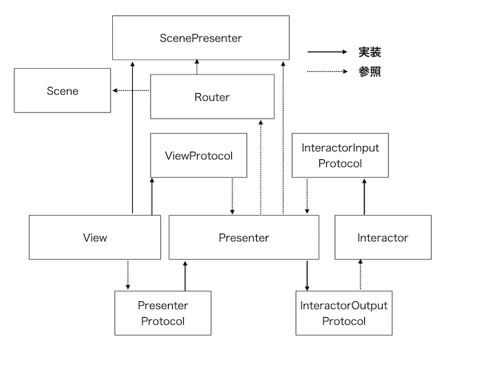

# SwiftVIPER (View, Interactor, Presenter, Entity, Router)

SwiftVIPER architecture for this Entry Test project using Swift [VIPER](https://cheesecakelabs.com/blog/ios-project-architecture-using-viper/) architecture.  
It is SwiftVIPER but it is not strict. [VIPER](https://cheesecakelabs.com/blog/ios-project-architecture-using-viper/) architecture.

[](https://swift.org)

## Sample App

<!---->

### Architecture


### Run Sample 
1. Clone this repository.
    ```
    git clone https://github.com/xkiRox/iOSPruebCeiba.git
    ```

2. Open `iOSPruebaCeiba.xcodeproj` in Xcode. 

3. Run

## Description
  
SwiftVIPER is not a strict [VIPER](https://cheesecakelabs.com/blog/ios-project-architecture-using-viper/) architecture.   


### View (including SwiftUI)
View was used in SwiftUI to be able to merge the old projects with the new SwiftUI view

### Unit Test 

WIP ... 

### Xcode Template ( xctemplate )

WIP ...

## Requirements

- Xcode 10.0+
- Swift 5+

## Installation

```
git clone https://github.com/xkiRox/iOSPruebCeiba.git
```

## Author

Hector Satizabal, zkiroz@gmail.com

## License

SwiftVIPER is available under the MIT license. See the LICENSE file for more info.
